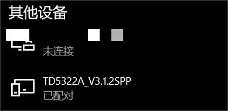
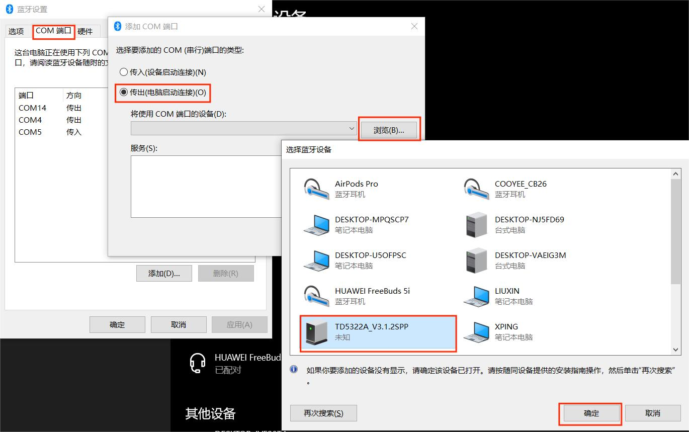
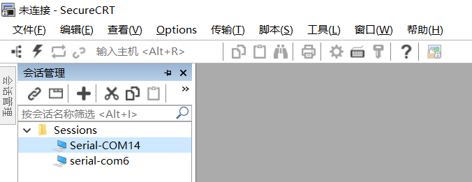
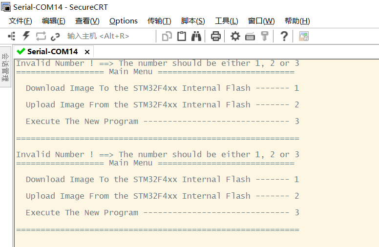

  <h1 align="center">BootLoader和APP说明</h1>

## :ledger: Overview

做蓝牙升级下载程序的目的就是, 当你的手表装到外壳中后, 不需要拆开就可以进行蓝牙IAP升级APP了~

Fireware文件夹中有`BootLoader_F411.hex`和`APP_OV_Watch_V2.4.0.bin`两个文件, 分别对应工程`Software`文件夹中的`IAP_F411`和`OV_Watch_V2.4.0`这两个工程, 分别都是这两个工程编译好生成的文件.

BootLoader和APP存储的空间大概如下图

	

## :warning:如何进入BootLoader的升级模式

确保手表下载好`BootLoader`后，上电开机时按住KEY1上按键, 记住是先按住KEY1, 然后再按KEY2上电 (或者调试模式时, 是按住KEY1再插下载器上电). 直接上电不按KEY1, 是直接进入APP的.

## :black_nib:如何烧录BootLoader

1. 首先使用下载器连接好手表的PCB板子的SWD口；
2. 打开keil工程编译好, 直接点击`Download`烧录即可；
3. 当然如果你不想碰代码，直接将`BootLoader_F411.hex`拖到`STM32 ST-LINK Utility`中进行烧录, 也挺方便.

	

! ! ! 温馨提醒: keil工程里面的设置不知道怎么改最好不要瞎改.

## :black_nib:如何进行APP烧录升级

1. 进入BootLoader的升级模式
1. 用你的电脑找到手表的蓝牙进行配对, 一般来讲蓝牙是叫KT6368A-SPP之类的, 具体的看自己情况嗷, 我这里是叫TD5322A

	

2. 然后找到`更多蓝牙设置`, 将配对的蓝牙添加进COM端口

	

3. 设置了上面之后, 以后就不用再设置了, 直接打开`SecureCRT`, 并连接到蓝牙对应的端口, 我这里是COM14, 然后开机上电时，按住KEY1进入Boot的升级模式, 然后会出现以下界面, 按照提示进行数字输入即可

	

	

4. 进入界面后, 输入`1`即可进行APP文件传输, 此时电脑一直会收到`CCCCCC...`, 此时就是在等待你用Ymodem协议发文件, 选择`send Ymodem`将`APP_OV_Watch_V2.4.0.bin`这个文件传进去即可, 过程比较慢, 耐心等待升级即可.

	

5. 最后传输完毕, 输入`3`即可执行APP, 等候开开机~
5. 以后每当APP有更新后，就算装进外壳了，也可以直接使用蓝牙无线升级啦~~
