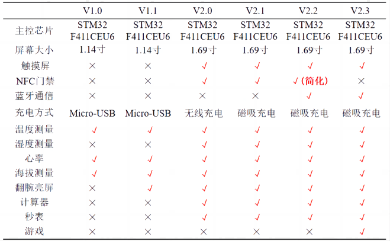
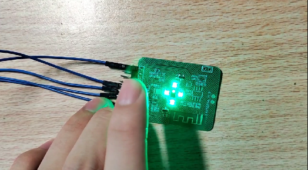

  <h1 align="center">OV-Watch</h1>

<div align=center>
        
        
        
</div>


## :ledger: Overview

A powerful Smart Watch

    

<div align=center>

</div>


## :link:视频链接：

<p align="center">
<a href="https://space.bilibili.com/34154740">bilibili主页 </a> |
<a href="https://www.bilibili.com/video/BV19g4y1N7YR/">V2.3新增功能视频 </a> |
<a href="https://www.bilibili.com/video/BV1hh4y1J7TS">V2.2演示视频 </a>
</p>


## :rocket: 增加的功能说明
修改的功能包括：

1. 心率部分，硬件增加LED矩阵，增强PPG信号强度

1. 双板改为贴合，不做4层板因为立创不能做盲埋孔

1. 蓝牙改为KT6328A 

1. MPU6050电路更改，V2.2的AUX接地了，导致之前的功耗高了，现在待机功耗几百uA 

1. 删除NFC部分，因为以前的设计NFC会被PCB铺铜以及屏幕铁皮屏蔽

1. 加入游戏（2048，记忆方块，MPU6050相关游戏）

   

## :bookmark_tabs:功能表如下图所示：

<div align=center>

</div>


## :star2:新版本实物图

<div align=center>

</div>

<div align=center>

</div>

<div align=center>

</div>

<div align=center>

</div>

<div align=center>

</div>

<div align=center>

</div>


## :computer:软件部分设计细节：

### 1.低功耗设计

手表的模式分为3个。第一个是正常的运行模式，手表正常运行；第二个是睡眠模式，MCU进入STOP模式，MPU6050仍在记步数；第三个是关机模式，TPS63020直接关闭使能，此时无3V3供电，只有Vbat有供电。

在最开始的时候，手表从睡眠到唤醒使用的是MPU6050的运动功能，打开中断，唤醒，但是这样尝试过，有个问题就是需要抖动幅度很大才能触发中断。所以最后还是用的RTC定时中断，然后定时检测当前手势状态，如果有抬腕动作则唤醒。

MPU6050不能直接使用DMP库，初始化后功耗很高，需要进行一些改动，才能让功耗下来，具体看工程代码。

蓝牙使用了KT6328A后，不建议关闭蓝牙使能，他的待机功耗很低。

### 2.心率血氧

血氧部分暂时还没有写。

心率计算本来使用的官方的库，但是计算太慢了，后面改为自己写的一个简易的峰值检测的算法。EM7028的PPG信号如下图所示

<div align=center>

</div>


### 3.数据存储

目前使用的外部的EEPROM进行数据存储，主要用于存储设置等，详细可以看`Datasave.c`文件。

### 4.页面切换逻辑

为了实现页面切换，可以返回上次的界面，这里使用了一个栈来存储页面对应的，例如，使用`user_Stack_Pop(&ScrRenewStack);`弹出上一个界面，然后进入到新的界面再使用 `user_Stack_Push(&ScrRenewStack,(long long int)&ui_HomePage);`入栈一个界面的指针地址。注意不能直接在push操作使用类似`ui_HomePage`入栈，它是会动态变化的，这是个很大的坑。

```c
//key1 pressed
if(keystr == 1)
{
    user_Stack_Pop(&ScrRenewStack);
    if(user_Stack_isEmpty(&ScrRenewStack))
    {
        ui_MenuPage_screen_init();
        lv_scr_load_anim(ui_MenuPage,LV_SCR_LOAD_ANIM_MOVE_RIGHT,0,0,true);
        user_Stack_Push(&ScrRenewStack,(long long int)&ui_HomePage);
        user_Stack_Push(&ScrRenewStack,(long long int)&ui_MenuPage);
    }
    else if(ScrRenewStack.Data[ScrRenewStack.Top_Point-1] == (long long int)&ui_HomePage)
    {
        ui_HomePage_screen_init();
        lv_scr_load_anim(ui_HomePage,LV_SCR_LOAD_ANIM_MOVE_RIGHT,0,0,true);
    }
}
```

### 5.计算器逻辑

计算器的逻辑就是很经典的计算器问题，经典的就是开两个栈，一个存放符号，一个存数字，然后进行出栈计算等等操作，以`1+2*6/3`为例，具体的过程如下动图所示。但是会有一个问题就是小数点，这个动图展示的只是整数计算的逻辑，带小数点的详细见代码。

<div align=center>

</div>
