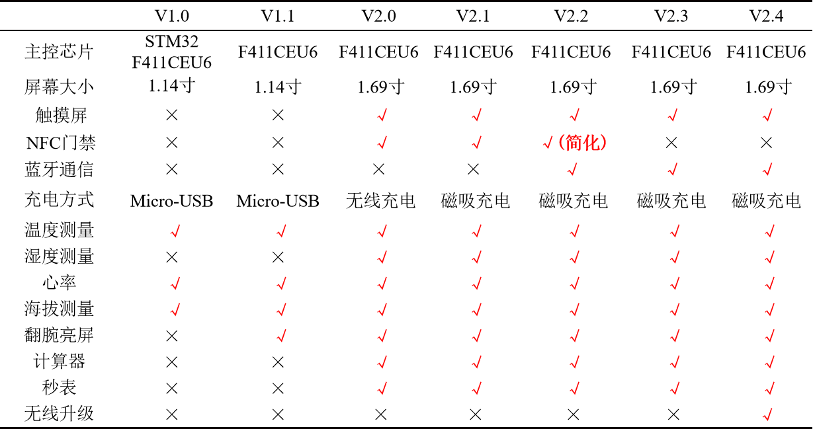
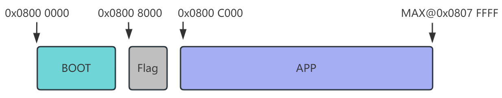
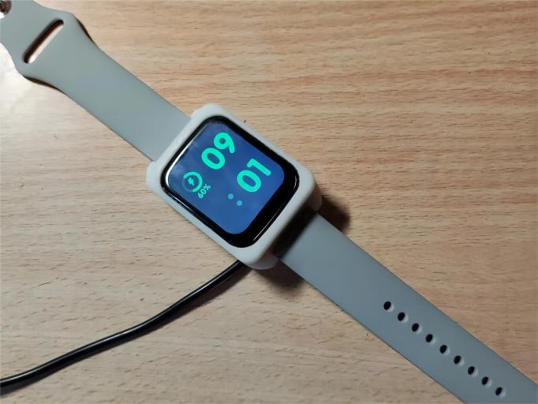
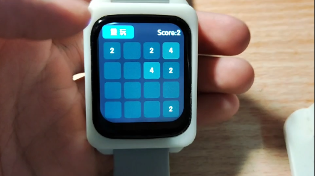
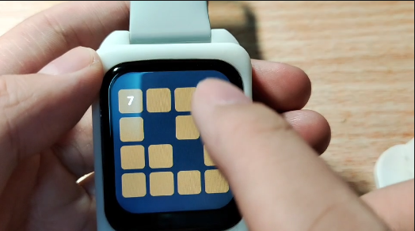
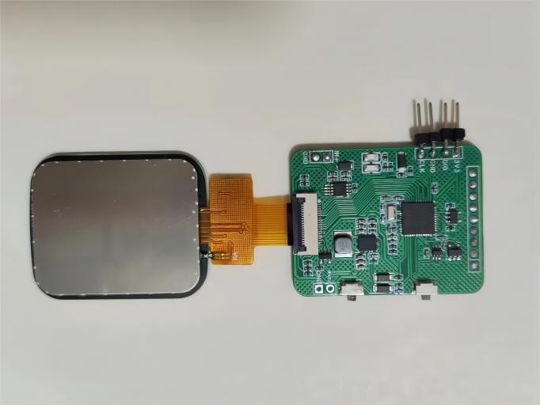
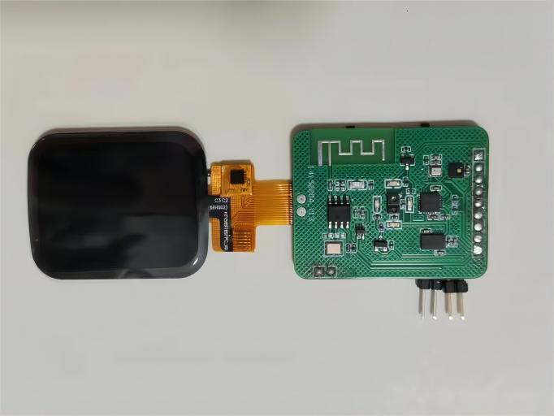
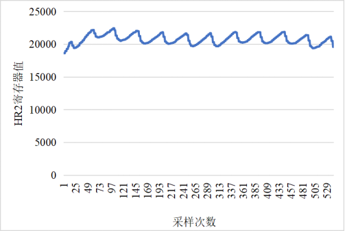
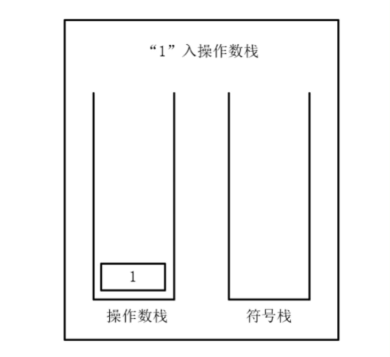

<p align="right">
  <b>中文</b> | <a href="./README_Eng.md">English</a> 
</p>

  <h1 align="center">OV-Watch</h1>

<div align=center>
        
        
        
    <br>
        
        
        
</div>


<br>

## :ledger: Overview

A powerful Smart Watch

如果你觉得这个手表的硬件难焊接难复刻，又想进行代码的学习，可以试一下新的STM32F411开发板：

FriPi炸鸡派：https://github.com/No-Chicken/FryPi

<p align="center">
	
</p>


<p align="center">
	
</p>
<br>

## :link:视频链接：

<p align="center">
<a href="https://space.bilibili.com/34154740">bilibili主页 </a> |
<a href="https://oshwhub.com/no_chicken/zhi-neng-shou-biao-OV-Watch_V2.2">硬件开源 </a>|
<a href="https://www.bilibili.com/video/BV19g4y1N7YR/">V2.3新增功能视频 </a> |
<a href="https://www.bilibili.com/video/BV1hh4y1J7TS">V2.2演示视频 </a>
</p>
<br>

## :black_nib:如何烧录：

由于具体的步骤太多这里不放了, 详细见Firmware中的README文件: [BootLoader和APP烧录说明](./Firmware/README.md)

如果你觉得带BootLoader的V2.4.0版本太麻烦了, 可以自行去下载[ver2.3.2分支](https://github.com/No-Chicken/OV-Watch/tree/ver2.3.2), 用以前的代码.

<br>

## :rocket: 增加的功能说明
#### V2.4.1相对V2.4.0修改的功能包括: 

1. 睡眠时DeInit串口的IO口，设置为输入，修复休眠功耗很高的情况，现在休眠状态电流800多uA.

1. BootLoader和APP都加入长按KEY1关机功能.

1. APP中按键的BSP改动，现在是按键按下松开才发生作用，避免了一些误触情况.

#### V2.4.0相对V2.3.2修改的功能包括: 

1. 更改了Back板硬件, 将蓝牙的使能电路修改，以前不能完全关闭，现在可以不用蓝牙时直接关了蓝牙，就可以不用KT6328A了，直接使用KT6368A, 有SPP功能, 可以无线升级.

1. 增加了BootLoader程序, 即分离了Boot和App.

1. 增加了IAP OTA功能, 即可以通过蓝牙升级程序.

1. 修改了一些bug.

<br>

## :bookmark_tabs:功能表：

<p align="center">
	
</p>
<br>

## :file_folder:软件架构：

<p align="center">
	
</p>

<br>

<p align="center">
	
</p>

<br>


## :star2:实物图

<p align="center">
	
</p>

<p align="center">
	
</p>

<p align="center">
	
</p>

<p align="center">
	
</p>

<p align="center">
	
</p>
<br>

## :computer:软件部分设计细节：

### 1.低功耗设计

手表的模式分为3个。第一个是正常的运行模式，手表正常运行；第二个是睡眠模式，MCU进入STOP模式，MPU6050仍在记步数；第三个是关机模式，TPS63020直接关闭使能，此时无3V3供电，只有Vbat有供电。

在最开始的时候，手表从睡眠到唤醒使用的是MPU6050的运动功能，打开中断，唤醒，但是这样尝试过，有个问题就是需要抖动幅度很大才能触发中断。所以最后还是用的RTC定时中断，然后定时检测当前手势状态，如果有抬腕动作则唤醒。

MPU6050不能直接使用DMP库，初始化后功耗很高，需要进行一些改动，才能让功耗下来，具体看工程代码。

蓝牙使用了KT6368A后，不用的时候关闭蓝牙使能，降低功耗。

最后接3V3测试，运行模式70-80mA，待机模式1mA左右，关机模式基本不耗电只有RTC在工作。当然后面没有测试电源接到Vbat端经过DCDC供电的情况，这个功耗就完全看DCDC的效率的。

### 2.心率血氧

血氧部分暂时还没有写。

心率计算本来使用的官方的库，但是计算太慢了，后面改为自己写的一个简易的峰值检测的算法。EM7028的PPG信号如下图所示

<p align="center">
	
</p>


### 3.数据存储

目前使用的外部的EEPROM进行数据存储，主要用于存储设置等，详细可以看`Datasave.c`文件。

### 4.页面切换逻辑

为了实现页面切换，可以返回上次的界面，这里使用了一个栈来存储页面对应的，例如，使用`user_Stack_Pop(&ScrRenewStack);`弹出上一个界面，然后进入到新的界面再使用 `user_Stack_Push(&ScrRenewStack,(long long int)&ui_HomePage);`入栈一个界面的指针地址。注意不能直接在push操作使用类似`ui_HomePage`入栈，它是会动态变化的，这是个很大的坑。

```c
//key1 pressed
if(keystr == 1)
{
    user_Stack_Pop(&ScrRenewStack);
    if(user_Stack_isEmpty(&ScrRenewStack))
    {
        ui_MenuPage_screen_init();
        lv_scr_load_anim(ui_MenuPage,LV_SCR_LOAD_ANIM_MOVE_RIGHT,0,0,true);
        user_Stack_Push(&ScrRenewStack,(long long int)&ui_HomePage);
        user_Stack_Push(&ScrRenewStack,(long long int)&ui_MenuPage);
    }
    else if(ScrRenewStack.Data[ScrRenewStack.Top_Point-1] == (long long int)&ui_HomePage)
    {
        ui_HomePage_screen_init();
        lv_scr_load_anim(ui_HomePage,LV_SCR_LOAD_ANIM_MOVE_RIGHT,0,0,true);
    }
}
```

### 5.计算器逻辑

计算器的逻辑就是很经典的计算器问题，经典的就是开两个栈，一个存放符号，一个存数字，然后进行出栈计算等等操作，以`1+2*6/3`为例，具体的过程如下动图所示。但是会有一个问题就是小数点，这个动图展示的只是整数计算的逻辑，带小数点的详细见代码。

具体过程是：

1. 遍历表达式，当遇到操作数，将其压入操作数栈。
2. 遇到运算符时，如果运算符栈为空，则直接将其压入运算符栈。
3. 如果运算符栈不为空，那就与运算符栈顶元素进行比较：如果当前运算符优先级比栈顶运算符高，则继续将其压入运算符栈，如果当前运算符优先级比栈顶运算符低或者相等，则从操作数符栈顶取两个元素，从栈顶取出运算符进行运算，并将运算结果压入操作数栈。
4. 继续将当前运算符与运算符栈顶元素比较。
5. 继续按照以上步骤进行遍历，当遍历结束之后，则将当前两个栈内元素取出来进行运算即可得到最终结果。

<p align="center">
	
</p>


### 6.LVGL在windows在vscode的仿真配置参考

参考链接: https://blog.csdn.net/weixin_49337111/article/details/136536375

已经更改好的可以跑的代码放在了`lv_sim_vscode_win`这个文件夹中，应该改一下配置的路径就可以直接使用vscode打开使用，记得改工程设置的路径。

<p align="center">
	
</p>


### 7.UI App如何移植

如果有更改UI App或者新加入UI App直接在仿真器中改好，然后直接复制`Func`文件夹和`GUI_App`文件夹去`keil`工程中的`User`文件夹即可。现在使用了一个`HWDataAccess.c`文件作为中间层，方便移植，如果是在仿真中，那么直接将`HW_USE_HARDWARE`设置为0即可跑通。
